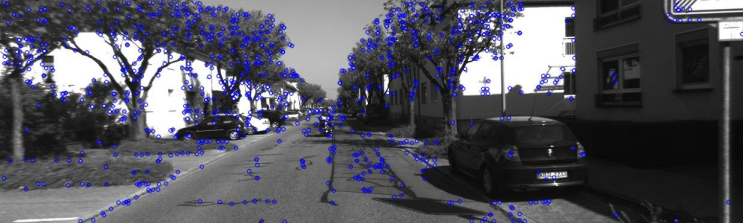

# Monocular Odometry

A monocular visual odometry demo using OpenCV, based on the method described by Avi Singh: https://avisingh599.github.io/vision/monocular-vo/

Check out the project outcome for a conceptual overview: [Project_Outcome.pdf](Project_Outcome.pdf)
## Installation
Run `pip install -r requirements.txt` in the environment you wish to install to.
## Running Odometry
Download the KITTI odometry dataset (grayscale) from [https://www.cvlibs.net/datasets/kitti/eval_odometry.php](https://www.cvlibs.net/datasets/kitti/eval_odometry.php) and store in the `data/` directory. The path to each sequence should look like `data/kitti/sequences/<sequence id>/`. Run `python src/odom.py <sequence id>` to start odometry. Tracjectory will be outputted to `results/poses/`
## Running Optimizer
Run `python src/loop_extractor.py <sequence id>` to extract loops from the ground truth and output to `results/loops/`. Run `python src/optimizer.py <sequence id>` to perform loop closure on the corresponding poses in the predicted trajectory and output to `results/eval/<sequence id>/`
## Future Work
In future work, methods such as Bag of Words may be used to detect loops during runtime so that loop closure solely relies on predicted data.